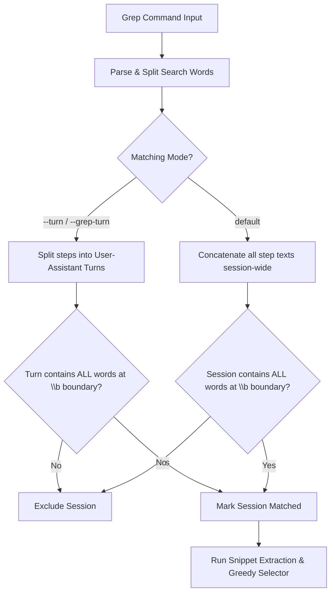
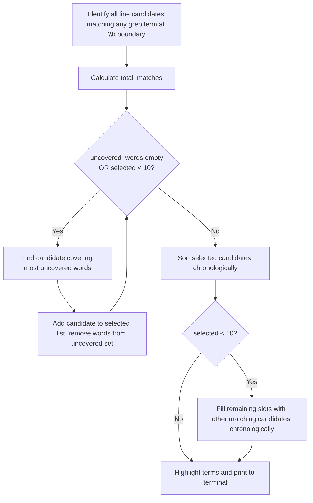

# agy-explore Grep Matching & Snippet Selection Logic

This document details the internal workflow of the `--grep` functionality in `agy-explore`. The search is designed around two core principles:
1. **Accurate Session Filtering**: Strict logical AND matching across search terms on a session-wide or turn-restricted scale, using word boundary checks to eliminate base64 and sub-word false positives.
2. **Fair Snippet Visualization**: A greedy coverage-based snippet selector that guarantees all matched search terms are represented in the displayed terminal output.

---

## 1. Matching & Filtering Pipeline

The grep filter runs in a multi-stage pipeline:



### Word Boundary Matching
To avoid false positives (such as `i3` matching inside long base64 hashes or redirect URLs), the matching logic enforces a word boundary (`\b`) preceding each word.
* **Match:** `i3-msg`, `i3wm`, `some i3`
* **Ignore:** `10Gi3`, `AUZIYQGtUHj9...`

---

## 2. Snippet Extraction & Greedy Coverage Selector

Once a conversation log matches all grep terms, `agy-explore` retrieves and prioritizes matching lines for display (capped at 10 total snippets).



### The Greedy Coverage Selection Algorithm

1. **Candidate Gathering**:
   - Every line in the session that contains at least one search word at a `\b` boundary is captured as a candidate.
   - The total number of matches is recorded in `total_matches`.

2. **Pass 1: Coverage Phase**:
   - We maintain a set of `uncovered_words` initially populated with all search words.
   - In each iteration, we search all candidates and select the one that covers the most `uncovered_words`.
   - If there is a tie, we select the candidate with the highest total matched words count, falling back to chronological order (earlier steps).
   - The covered words are removed from `uncovered_words`, and the selected candidate is saved.
   - This repeats until all search words are represented in our selected list, or we reach the 10-snippet limit.

3. **Pass 2: Padding Phase**:
   - If we have chosen fewer than 10 snippets and there are remaining candidate lines, we fill the empty slots using the remaining candidates in chronological order.

4. **Sort and Output**:
   - The selected snippets are sorted chronologically.
   - Terminal highlight colors are applied using `\b` boundary restrictions to highlight only matching words.

---

## 3. Highlighting Mechanics

The ANSI highlighting logic is regex-driven, utilizing compiled patterns that preserve zero-width word boundaries:

```python
pattern = re.compile(rf"\b({'|'.join(escaped_words)})", re.IGNORECASE)
replacement = f"{highlight_color}\\1{CLR_RESET}{context_color}"
```
This ensures terms like `i3` inside `10Gi3` remain uncolored, while instances like `-i3` or `i3` are highlighted cleanly in yellow.
