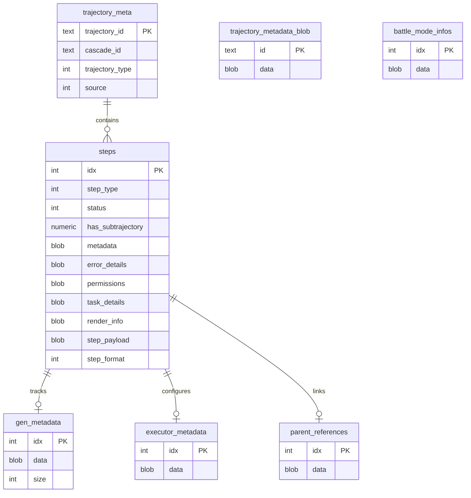

# Antigravity CLI (`agy`) Database Architecture & Storage Internals

This document provides a technical specification and engineering reference for the database systems used by the **Antigravity CLI** (`agy`) and Antigravity agent execution environment.

---

## 1. Storage Topology & Overview

Antigravity operates a hybrid storage architecture combining **SQLite 3 relational databases** (in Write-Ahead Logging mode), **Protobuf binary/text streams**, and **JSON Lines journal logs**:

```mermaid
flowchart TD
    subgraph Antigravity Storage [~/.gemini/antigravity-cli]
        direction TB
        CS[conversation_summaries.db\nGlobal Index Catalog]
        
        subgraph Conversations [conversations/]
            CDB1[<conv-id-1>.db\nSession Trajectory]
            CDB2[<conv-id-2>.db\nSession Trajectory]
            CDBWAL[<conv-id>.db-wal\nWrite-Ahead Log]
            CPB[<conv-id>.pb\nLegacy Protobuf Pre-June 2026]
        end
        
        subgraph Brain [brain/<conv-id>/]
            TJSONL[.system_generated/logs/transcript.jsonl]
            TFULL[.system_generated/logs/transcript_full.jsonl]
            STEPS[.system_generated/steps/<idx>/output.txt]
        end
        
        subgraph Telemetry & Cache [cache/ & root]
            HIST[history.jsonl\nUser Prompt Journal]
            LCONV[cache/last_conversations.json\nWorkspace Pointers]
            CMETA[cache/conversation_metadata.json]
            PRES[presence/<conv-id>.lock\nConcurrency Locks]
        end
    end

    agy[Antigravity CLI Engine] -->|Fast catalog index / query| CS
    agy -->|Live step append / trajectory state| CDB1
    agy -->|Append prompt history| HIST
    agy -->|Update active session pointer| LCONV
    agy -->|Stream human-readable logs| TFULL
```



### Storage Roles Breakdown

| Storage File / Path | Format | Journal / Mode | Purpose & Data Retained |
|---|---|---|---|
| `conversation_summaries.db` | SQLite 3.x | WAL (`user_version=3`) | Global cross-workspace catalog, title previews, step tallies, and user turn timestamps. |
| `conversations/<uuid>.db` | SQLite 3.x | WAL (`user_version=1`) | Authoritative per-session execution engine trajectory, step payloads, and runtime metadata. |
| `conversations/<uuid>.db-wal` | SQLite WAL | Version 3007000 | In-flight atomic transaction buffer for the active session. |
| `conversations/<uuid>.db-shm` | Shared Memory | Page size 4096 | Shared memory index for the WAL index during concurrent read/writes. |
| `conversations/<uuid>.pb` | Protobuf binary | Immutable binary | Legacy pre-June 2026 trajectory storage before migration to SQLite. |
| `brain/<uuid>/.system_generated/` | JSONL & Text | Append-only logs | Human-readable transcripts (`transcript.jsonl`, `transcript_full.jsonl`) and tool outputs. |
| `history.jsonl` | JSON Lines | Append-only | Chronological log of user prompts, timestamps, and workspace directories. |
| `cache/last_conversations.json` | JSON | Key-Value | Pointers mapping `workspace_path -> active_conversation_id`. |
| `presence/<uuid>.lock` | Zero-byte file | POSIX flock/touch | Active session concurrency and process liveness lockfile. |

---

## 2. Global Catalog Database: `conversation_summaries.db`

The catalog database is located at `~/.gemini/antigravity-cli/conversation_summaries.db`. It provides high-performance conversation discovery and metadata lookups without requiring the CLI to open and scan individual multi-megabyte trajectory databases.

### Pragmas & Configuration
- **SQLite Version:** 3.53+ compatible
- **Journal Mode:** `WAL` (Write-Ahead Logging)
- **User Version:** `3` (`PRAGMA user_version = 3`)
- **Page Size:** 4096 bytes

### Schema Definition

```sql
CREATE TABLE `conversation_summaries` (
    `conversation_id`            TEXT,
    `title`                      TEXT NOT NULL DEFAULT "",
    `preview`                    TEXT NOT NULL DEFAULT "",
    `step_count`                 INTEGER NOT NULL DEFAULT 0,
    `last_modified_time`         DATETIME NOT NULL,
    `workspace_uris`             TEXT NOT NULL,
    `status`                     TEXT NOT NULL DEFAULT "",
    `source`                     TEXT NOT NULL DEFAULT "",
    `project_id`                 TEXT NOT NULL DEFAULT "",
    `agent_name`                 TEXT NOT NULL DEFAULT "",
    `parent_conversation_id`     TEXT NOT NULL DEFAULT "",
    `nesting_depth`              INTEGER NOT NULL DEFAULT 0,
    `battle_id`                  TEXT NOT NULL DEFAULT "",
    `winning_conversation_id`    TEXT NOT NULL DEFAULT "",
    `not_fully_idle`             NUMERIC NOT NULL DEFAULT false,
    `killed`                     NUMERIC NOT NULL DEFAULT false,
    `last_user_input_time`       DATETIME NOT NULL,
    `last_user_input_step_index` INTEGER NOT NULL DEFAULT -1,
    `app_data_dir`               TEXT NOT NULL DEFAULT "",
    `raw_summary`                BLOB,
    `group_id`                   TEXT NOT NULL DEFAULT '',
    PRIMARY KEY (`conversation_id`)
);

CREATE INDEX `idx_conversation_summaries_last_user_input_time` 
    ON `conversation_summaries`(`last_user_input_time`);

CREATE INDEX `idx_conversation_summaries_last_modified_time` 
    ON `conversation_summaries`(`last_modified_time`);
```

### Column Specifications

| Column | Type | Constraints | Description |
|---|---|---|---|
| `conversation_id` | `TEXT` | `PRIMARY KEY` | UUIDv4 identifying the conversation/cascade. |
| `title` | `TEXT` | `NOT NULL DEFAULT ""` | Explicit conversation title (empty when auto-titled). |
| `preview` | `TEXT` | `NOT NULL DEFAULT ""` | Dynamic summarization snippet (e.g., `"Investigating WS2 HTTP Latency"`). |
| `step_count` | `INTEGER` | `NOT NULL DEFAULT 0` | Total number of trajectory steps recorded. |
| `last_modified_time` | `DATETIME` | `NOT NULL` | ISO 8601 UTC timestamp of last activity. |
| `workspace_uris` | `TEXT` | `NOT NULL` | JSON array of workspace file URIs (e.g. `["file:///home/user/agy-explore"]`). |
| `status` | `TEXT` | `NOT NULL DEFAULT ""` | Lifecycle status flag. |
| `source` | `TEXT` | `NOT NULL DEFAULT ""` | Subsystem source descriptor. |
| `project_id` | `TEXT` | `NOT NULL DEFAULT ""` | Associated project UUID or `"default-cli-project"`. |
| `agent_name` | `TEXT` | `NOT NULL DEFAULT ""` | Subagent designation or model persona. |
| `parent_conversation_id` | `TEXT` | `NOT NULL DEFAULT ""` | Parent session UUID when spawned as a subagent. |
| `nesting_depth` | `INTEGER` | `NOT NULL DEFAULT 0` | Hierarchy depth (`0` = root user conversation, `1+` = subagents). |
| `battle_id` | `TEXT` | `NOT NULL DEFAULT ""` | Identifier for model comparison / A/B battle evals. |
| `winning_conversation_id` | `TEXT` | `NOT NULL DEFAULT ""` | Winning conversation ID from an evaluation run. |
| `not_fully_idle` | `NUMERIC` | `NOT NULL DEFAULT false` | `1` if background tasks/model generation are actively running. |
| `killed` | `NUMERIC` | `NOT NULL DEFAULT false` | `1` if the session was explicitly cancelled by the user. |
| `last_user_input_time` | `DATETIME` | `NOT NULL` | Timestamp of the most recent explicit prompt sent by the user. |
| `last_user_input_step_index` | `INTEGER` | `NOT NULL DEFAULT -1` | `steps.idx` pointer of the last user turn. |
| `app_data_dir` | `TEXT` | `NOT NULL DEFAULT ""` | Name of active application directory (typically `"antigravity-cli"`). |
| `raw_summary` | `BLOB` | `NULLABLE` | Serialized protobuf representation of summary metadata. |
| `group_id` | `TEXT` | `NOT NULL DEFAULT ""` | Logical grouping tag. |

---

## 3. Session State Databases: `conversations/<uuid>.db`

Every active Antigravity session maintains an isolated SQLite database file under `~/.gemini/antigravity-cli/conversations/<uuid>.db`. This database serves as the write-ahead execution ledger for all agent steps, tool calls, thinking cycles, and workspace metadata.

### Pragmas & Configuration
- **SQLite Version:** 3.53+ compatible
- **Journal Mode:** `WAL`
- **User Version:** `1` (`PRAGMA user_version = 1`)
- **Page Size:** 4096 bytes

### Schema & Table Relationships



---

### Table Details

#### 3.1. `trajectory_meta`
Maps internal trajectory IDs to conversation IDs and identifies execution parameters:
```sql
CREATE TABLE `trajectory_meta` (
    `trajectory_id`   TEXT,
    `cascade_id`      TEXT,
    `trajectory_type` INTEGER,
    `source`          INTEGER,
    PRIMARY KEY (`trajectory_id`)
);
```
- `trajectory_id`: Unique execution run UUID.
- `cascade_id`: The user-facing `conversation_id`.
- `trajectory_type`: Value `4` denotes interactive agent coding trajectory.
- `source`: Value `17` denotes the native CLI terminal runner (`antigravity-cli`).

#### 3.2. `steps`
Contains every discrete execution event (user turn, model planning cycle, tool invocation, tool execution output):
```sql
CREATE TABLE `steps` (
    `idx`                INTEGER,
    `step_type`          INTEGER NOT NULL DEFAULT 0,
    `status`             INTEGER NOT NULL DEFAULT 0,
    `has_subtrajectory`  NUMERIC NOT NULL DEFAULT false,
    `metadata`           BLOB,
    `error_details`      BLOB,
    `permissions`        BLOB,
    `task_details`       BLOB,
    `render_info`        BLOB,
    `step_payload`       BLOB,
    `step_format`        INTEGER NOT NULL DEFAULT 0,
    PRIMARY KEY (`idx`)
);

CREATE INDEX `idx_steps_status` ON `steps`(`status`);
CREATE INDEX `idx_steps_step_type` ON `steps`(`step_type`);
```

##### Decoded `step_type` Enums

| Value | Internal Semantic | Tool / Event Equivalent | Description |
|---|---|---|---|
| `5` | `TOOL_WRITE_FILE` | `write_to_file` | File creation or overwrite. |
| `7` | `TOOL_GREP_SEARCH` | `grep_search` | Ripgrep pattern search across workspace. |
| `8` | `TOOL_VIEW_FILE` | `view_file` | Source code and file viewer. |
| `9` | `TOOL_LIST_DIR` | `list_dir` | Directory recursive listing. |
| `14` | `USER_INPUT` | `<USER_REQUEST>` | Raw prompt received from the user. |
| `15` | `PLANNER_RESPONSE` | Assistant Thoughts / Calls | Model thinking process and tool invocation requests. |
| `17` | `TOOL_VIEW_CHUNK` | `view_file` | Targeted range/chunk file viewing. |
| `21` | `TOOL_RUN_COMMAND` | `run_command` | Shell bash command execution. |
| `23` | `PLANNER_CONTINUE` | Continuation step | Model output segment continuation. |
| `28` | `TOOL_CMD_STATUS` | `manage_task` | Status poll on running background commands. |
| `31` | `TOOL_READ_URL` | `read_url_content` | HTTP GET fetch and markdown extraction. |
| `33` | `TOOL_SEARCH_WEB` | `search_web` | Web search execution. |
| `98` | `TRAJECTORY_START` | Init event | Trajectory startup and session configuration event. |
| `101` | `SYSTEM_MESSAGE` | Background Wakeup | Notification on task completion or agent message. |
| `132` | `TOOL_LIST_PERMS` | `list_permissions` | Permission boundary query. |
| `138` | `TOOL_ASK_QUESTION`| `ask_question` | Interactive multiple-choice modal prompt. |
| `139` | `SUBAGENT_EVENT` | `invoke_subagent` | Subagent lifecycle and message transmission. |

##### Decoded `status` Enums

| Value | Meaning | Description |
|---|---|---|
| `2` | `RUNNING` | Step actively executing in background. |
| `3` | `COMPLETED` | Execution completed successfully (`DONE`). |
| `5` | `HANDLED` | Event acknowledged or suppressed by agent runtime. |
| `6` | `ERROR` | Execution resulted in non-zero exit code or exception. |
| `7` | `CANCELLED` | Action explicitly terminated by agent or user. |
| `8` | `TIMEOUT` | Operation exceeded synchronous execution threshold. |

#### 3.3. `trajectory_metadata_blob`
Stores serialized session environment configuration under primary key `id = 'main'`:
```sql
CREATE TABLE `trajectory_metadata_blob` (
    `id`   TEXT DEFAULT "main",
    `data` BLOB,
    PRIMARY KEY (`id`)
);
```
Contains binary Protobuf encoding the following attributes:
- **`WorkspaceURIs`**: `file:///home/user/agy-explore`
- **`Repository Identifier`**: `user/agy-explore`
- **`Git Remote URL`**: `git@github.com:user/agy-explore.git`
- **`Git Branch`**: `main`
- **`Project ID`**: `"default-cli-project"`
- **`Client Session UUID`**: Unique device session identifier.

#### 3.4. `gen_metadata`
Stores model generation diagnostics for each agent thinking turn:
```sql
CREATE TABLE `gen_metadata` (
    `idx`  INTEGER,
    `data` BLOB,
    `size` INTEGER NOT NULL DEFAULT 0,
    PRIMARY KEY (`idx`)
);
```
Payload contains generation identifiers, model name, request/response token allocations, and stop conditions.

#### 3.5. `executor_metadata`
Stores execution environment parameters and linters:
```sql
CREATE TABLE `executor_metadata` (
    `idx`  INTEGER,
    `data` BLOB,
    PRIMARY KEY (`idx`)
);
```
Retains IDE rule instructions, linter patterns, environment paths, and tool permission restrictions enforced during step `idx`.

---

## 4. Architectural Evolution: Protobuf (`.pb`) to SQLite (`.db`)

Prior to June 2026, Antigravity persisted sessions as monolithic serialized Protobuf binaries (`conversations/<uuid>.pb`).

```
May 2026 (Protobuf)                     June 2026+ (SQLite WAL)
┌──────────────────────────────┐        ┌──────────────────────────────┐
│  conversations/<uuid>.pb     │  ───►  │  conversations/<uuid>.db     │
│  - Monolithic serialization  │        │  - Indexed step queries      │
│  - Entire file loaded to RAM │        │  - Incremental WAL streaming │
│  - Fragile on crash/SIGKILL  │        │  - ACID transactional writes │
└──────────────────────────────┘        └──────────────────────────────┘
```

### Why SQLite Replaced Monolithic Protobufs:
1. **Incremental Streaming & Low RAM Overhead**: Long sessions (such as sessions with >2,000 steps) can grow to over 150 MB. In `.pb` format, the entire file had to be parsed in RAM on every update. With SQLite, new steps are appended to `steps` with indexed access in $O(1)$ time.
2. **Crash Resilience via WAL**: If an agent process or machine crashes mid-tool-execution, SQLite Write-Ahead Logging ensures zero corruption of preceding steps.
3. **Selective Querying**: Tools like `agy-explore` can query only `trajectory_metadata_blob` (taking ~0.3ms) to resolve workspace associations across hundreds of sessions without parsing step payloads.

---

## 5. Practical Inspection Queries

### 5.1. Global Catalog Inspection (`conversation_summaries.db`)

#### Count Sessions per Workspace
```bash
sqlite3 ~/.gemini/antigravity-cli/conversation_summaries.db \
  "SELECT workspace_uris, COUNT(*) FROM conversation_summaries GROUP BY workspace_uris ORDER BY count(*) DESC;"
```

#### Find Sessions by Workspace Path
```bash
sqlite3 ~/.gemini/antigravity-cli/conversation_summaries.db \
  "SELECT conversation_id, preview, last_modified_time FROM conversation_summaries WHERE workspace_uris LIKE '%agy-explore%';"
```

#### Check Active or Longest Conversations
```bash
sqlite3 ~/.gemini/antigravity-cli/conversation_summaries.db \
  "SELECT conversation_id, step_count, preview, last_modified_time FROM conversation_summaries ORDER BY step_count DESC LIMIT 10;"
```

---

### 5.2. Session State DB Inspection (`conversations/<uuid>.db`)

#### Extract Workspace URI & Git Metadata
```bash
sqlite3 ~/.gemini/antigravity-cli/conversations/<conversation_id>.db \
  "SELECT quote(data) FROM trajectory_metadata_blob WHERE id = 'main';"
```

#### Inspect Step Types and Error Rates
```bash
sqlite3 ~/.gemini/antigravity-cli/conversations/<conversation_id>.db \
  "SELECT step_type, status, count(*) FROM steps GROUP BY step_type, status ORDER BY count(*) DESC;"
```

#### Retrieve All Shell Commands Run During a Session
```python
import sqlite3, os, re

db = sqlite3.connect(os.path.expanduser("~/.gemini/antigravity-cli/conversations/<conversation_id>.db"))
cur = db.cursor()
# step_type 21 = run_command
cur.execute("SELECT idx, step_payload FROM steps WHERE step_type = 21 ORDER BY idx")
for idx, payload in cur.fetchall():
    match = re.search(rb"CommandLine[^\x20-\x7e]*([^\x00-\x1f\x7f-\xff]+)", payload)
    if match:
        print(f"Step {idx:3d}: {match.group(1).decode('latin1', 'ignore')}")
```
